--- 
title: "Manual de usuario de MonitorEO-OBSNEV"
author: "Observatorio de Cambio Global de Sierra Nevada. Universidad de Granada"
date: "2026-04-14"
site: bookdown::bookdown_site
output: bookdown::gitbook
documentclass: book
bibliography: [book.bib, packages.bib]
biblio-style: apalike
link-citations: yes
github-repo: monitoreo-obsnev/manual
description: "Documentación de la herramienta MonitorEO-OBSNEV."
---

# Introducción {#intro}

[MonitorEO-OBSNEV](https://sl.ugr.es/monitoreoobsnev) es una herramienta de análisis de variables derivadas de teledetección satelital basada en Google Earth Engine desarrollada por el Observatorio de Cambio Global de Sierra Nevada (Universidad de Granada).

Este manual de usuario proporciona una guía completa para el uso de MonitorEO-OBSNEV, incluyendo la descripción de funcionalidades, navegación por la interfaz, selección de parámetros y visualización de resultados.

Este proyecto ha sido desarrollado en el marco del trabajo del Observatorio de Cambio Global de Sierra Nevada, de la Universidad de Granada, a través de los proyectos:

- **"EVEREST" (PID2023-151939OB-I00)**, financiado por el Ministerio de Ciencia, Innovación y Universidades (MICIU) / Agencia Estatal de Investigación (AEI) 10.13039/501100011033, y cofinanciado por el Fondo Europeo de Desarrollo Regional (FEDER – Unión Europea). 

- **"Observaciones de la Tierra para la caracterización y seguimiento del funcionamiento de los ecosistemas en Sierra Nevada (España)" (C-EXP-074-UGR23)**, cofinanciado por el Programa FEDER 2014-2020 y la Consejería de Economía, Conocimiento, Empresa y Universidades de la Junta de Andalucía.

{width=850px}

<!--chapter:end:index.Rmd-->

# Interfaz de MonitorEO-OBSNEV {#interfaz}

La interfaz gráfica del **Laboratorio de Investigación Virtual MonitorEO-OBSNEV** (*Monitoring with Earth Observations* del **Observatorio de Cambio Global de Sierra Nevada**) proporciona acceso a un sistema avanzado de monitoreo y alerta basado en datos de teledetección.

Este sistema ha sido diseñado para la observación, análisis y evaluación de **variables esenciales de la biodiversidad (Essential Biodiversity Variables, EBVs)** vinculadas al funcionamiento y la estructura de los ecosistemas. La interfaz permite la exploración espacial y temporal de estas variables en diferentes regiones del planeta, con especial énfasis en áreas protegidas de montaña.

MonitorEO-OBSNEV integra colecciones de datos satelitales, herramientas de análisis geoespacial y una interfaz interactiva que facilita su uso tanto en estudios científicos como en aplicaciones de gestión.

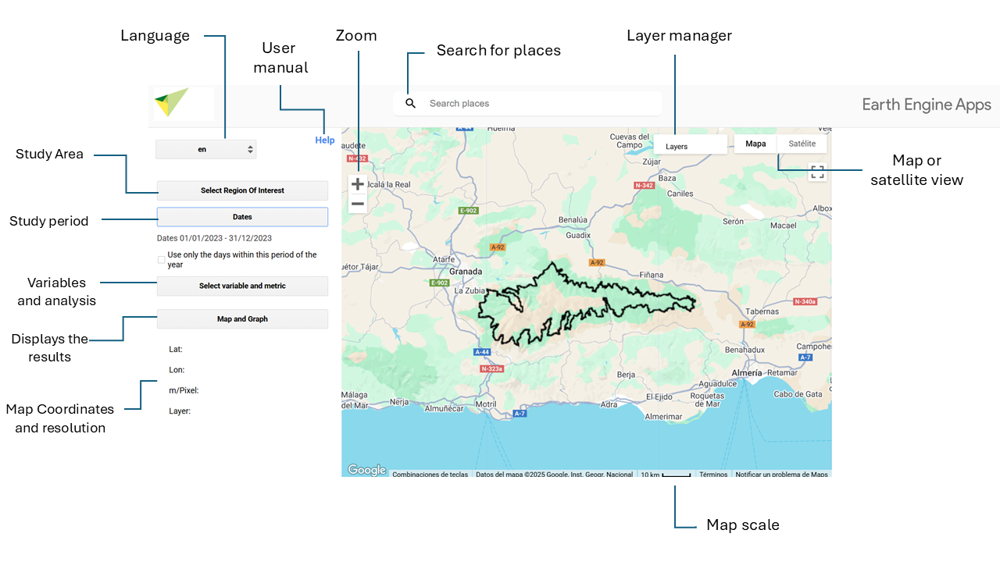

<!--chapter:end:01-interfaz.Rmd-->

# Idiomas {#idiomas}

🌐 Selecciona el idioma de la interfaz. Están disponibles las siguientes opciones:

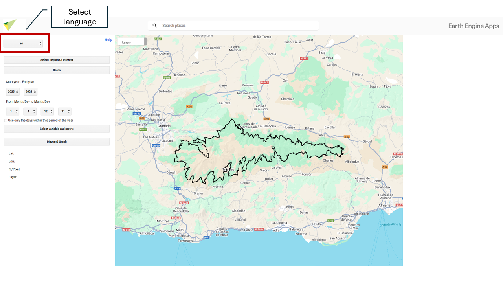

- **es** 
Español

- **en** 
English

- **fr** 
Français

- **de** 
Deutsch

<!--chapter:end:02-idioma.Rmd-->

# Área de estudio {#area-estudio}

**Selecciona ROI– Elige tu área de estudio.** 

En esta sección puedes definir la **región de interés (ROI)** sobre la que se realizará el análisis. Tienes varias opciones disponibles para seleccionar o cargar tu área de estudio. Por defecto, la herramienta está configurada para dibujar polígonos personalizados. Para cambiar el tipo de geometría (por ejemplo, a punto o rectángulo), accede al menú de opciones de dibujo antes de definir la región de interés.

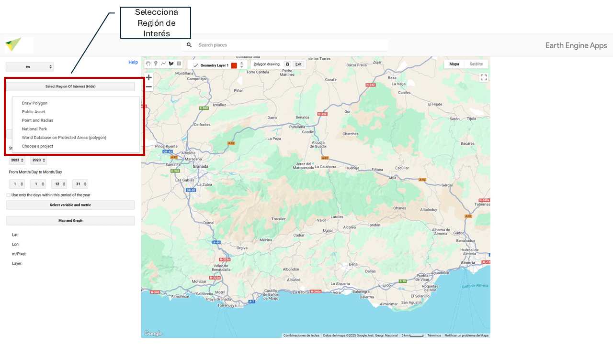

## **🖊️ Dibujar tu región de interés (ROI \- Region of Interest)**

Puedes dibujar regiones manualmente usando esta opción. Cuando dibujas una región (punto, línea o polígono), esta se almacena como un objeto Geometry que aparecerá como capa en la parte superior izquierda del mapa.

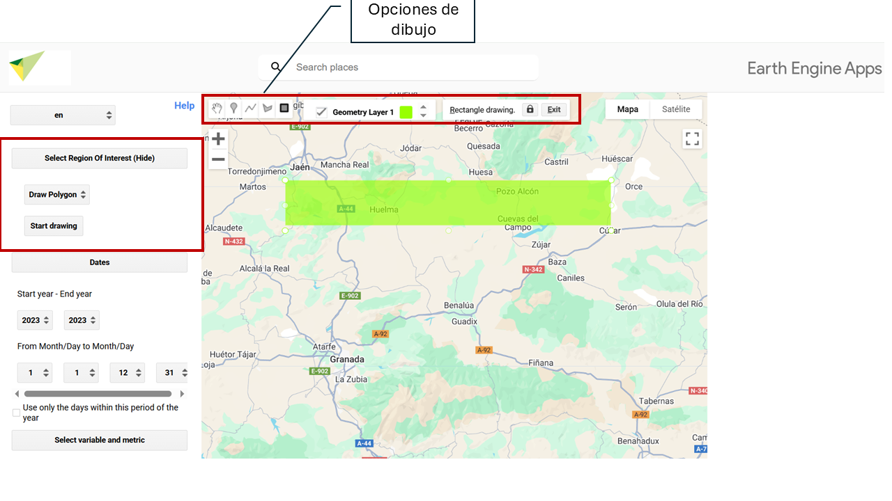

## 📂 **Uso de un Asset Público o Propio**

Para cargar un asset (como tu área de estudio, por ejemplo, un shapefile), necesitas tener una cuenta activa en **Google Earth Engine (GEE)**. Si aún no tienes una cuenta, puedes crearla fácilmente siguiendo esta guía paso a paso: [Cómo registrarse en Google Earth Engine](https://ecoinfugr.github.io/ecoinformatica/sesiones/teledeteccion/register_GEE_jml.html).

Una vez que tu cuenta esté activa, podrás subir tus propios datos espaciales en GEE siguiendo estos pasos:

### Accede a la herramienta de subida

1. Ve a [Google Earth Engine Code Editor](https://code.earthengine.google.com).
2. En la esquina izquierda, haz clic en el ícono de **Assets** .
3. Haz clic en el botón **NEW**.

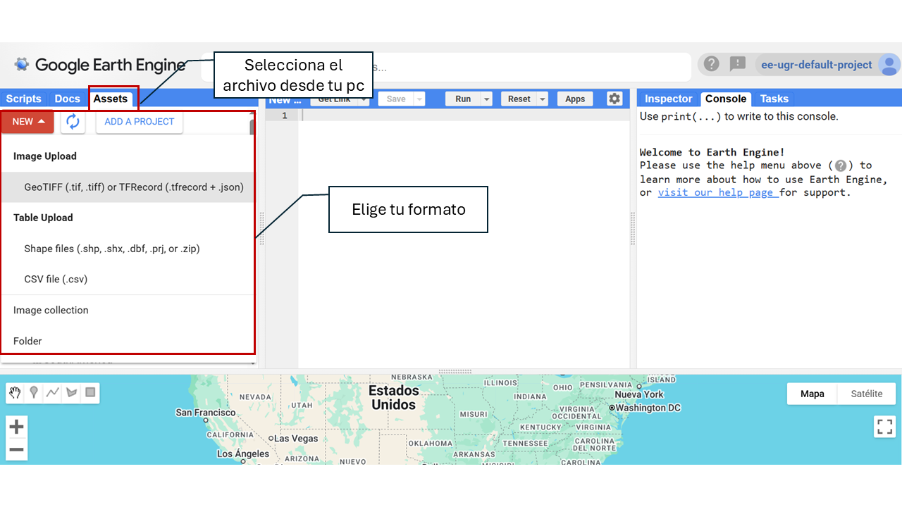

### Sube el archivo

1. Elige el tipo de archivo: **Image (raster)** o **Table (vector)**.
2. Selecciona el archivo desde tu pc.
3. Define la **carpeta de destino** dentro de tus assets (ejemplo: `users/tu_usuario/mi_asset`).
4. Haz clic en **UPLOAD**.

### Espera el procesamiento

- El archivo pasará por un proceso de **subida**.
- Puedes ver el estado en la sección de **Tasks**.
- Una vez procesado, el asset estará disponible en tu cuenta de GEE.

### Usa el asset en MonitorEO

Una vez subido, debes asegurarte de:	

* Copiar y pegar correctamente esta ruta para que el recurso pueda cargarse sin errores.

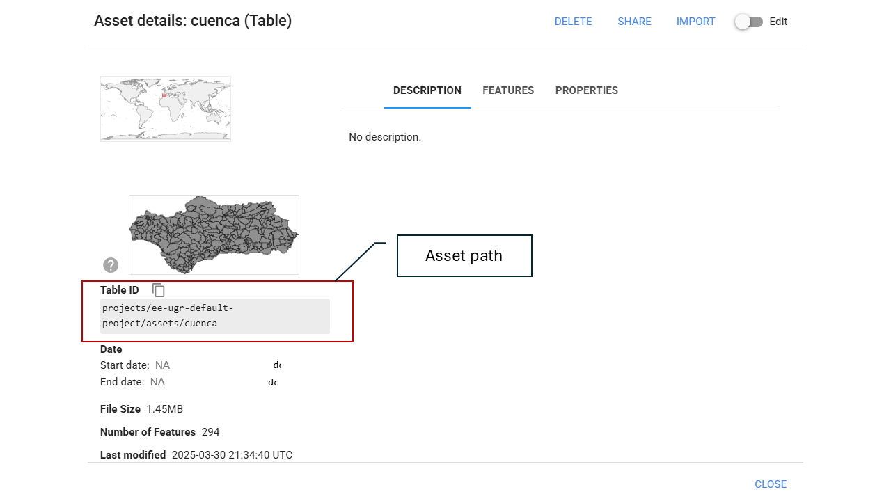

* Compartir el asset como público.

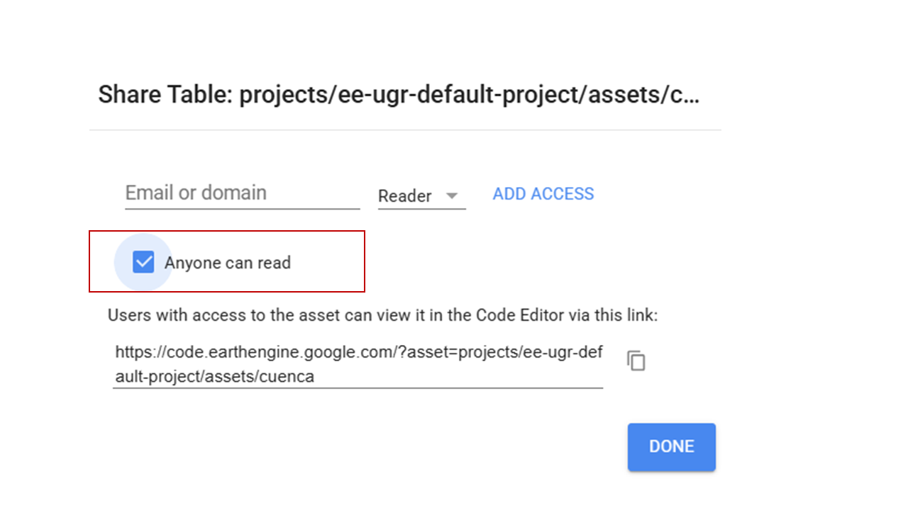

A continuación, salimos de GEE y nos vamos de nuevo a la app MonitorEO. Ahí indica la ruta del asset, es decir, la dirección única donde se encuentra almacenado el recurso dentro de tu cuenta de GEE.
Esta ruta suele tener el siguiente formato:

* **`users/tu_usuario/nombre_del_asset`**

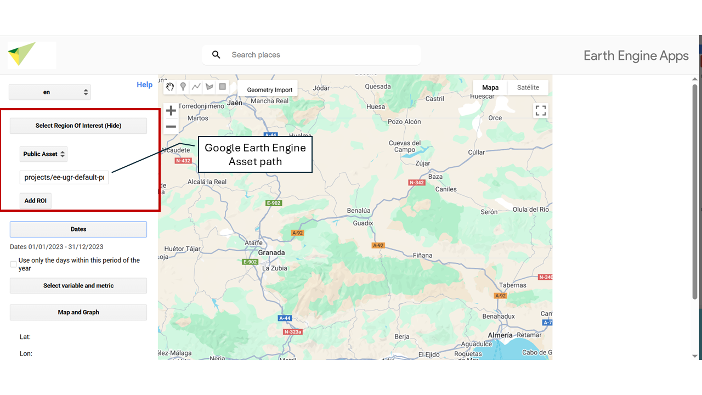

## **📌Punto específico y radio**

Puedes introducir coordenadas de **latitud** y **longitud** para definir una ubicación exacta sobre la superficie terrestre. A partir de ese punto, se puede generar un área circular (**buffer**) cuyo **radio, en metros, es definido por el usuario**. Esta funcionalidad permite delimitar zonas de interés alrededor de un punto específico para su análisis. 

Latitud: Ingresa la coordenada decimal de latitud (por ejemplo: -37.6009).
Usa el punto (.) como separador decimal. No uses comas ni símbolos adicionales.

Longitud: Ingresa la coordenada decimal de longitud (por ejemplo: -63.854). 
También debe estar en formato decimal con punto. Recuerda tener en cuenta el símbolo negativo si es necesario.

Radio: Introduce el radio en metros (por ejemplo: 1000 para un kilómetro).

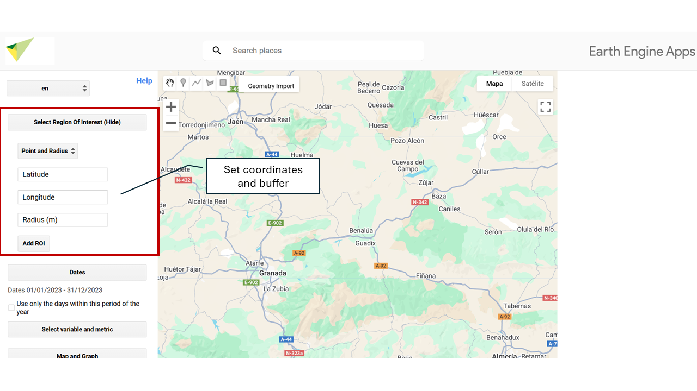

## **🏞️ Parque Nacional**

Puedes seleccionar como área de estudio cualquiera de los **Parques Nacionales de España y Portugal** disponibles en la plataforma.

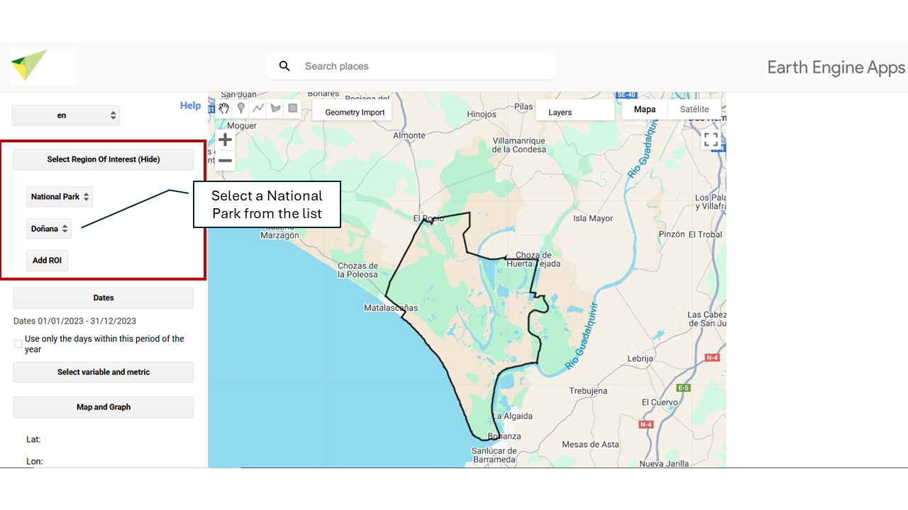

## **🌍 Base de datos mundial sobre zonas protegidas WDPA** 

World Database on Protected Areas (WDPA), es la fuente más completa y actualizada de información geoespacial sobre áreas protegidas a nivel global. Gestionada por ONU Medio Ambiente y el Centro de Monitoreo de la Conservación del Medio Ambiente (UNEP-WCMC), proporciona datos detallados sobre parques nacionales, reservas naturales y otras zonas protegidas.

Para seleccionar un área protegida mediante su ID, puedes acceder a la base de datos a través del sitio web oficial de Protected Planet ([🔗 protectedplanet.net](https://www.protectedplanet.net/)). Allí, puedes buscar áreas protegidas por nombre, país o categoría de protección y obtener su identificador único (WDPA ID).

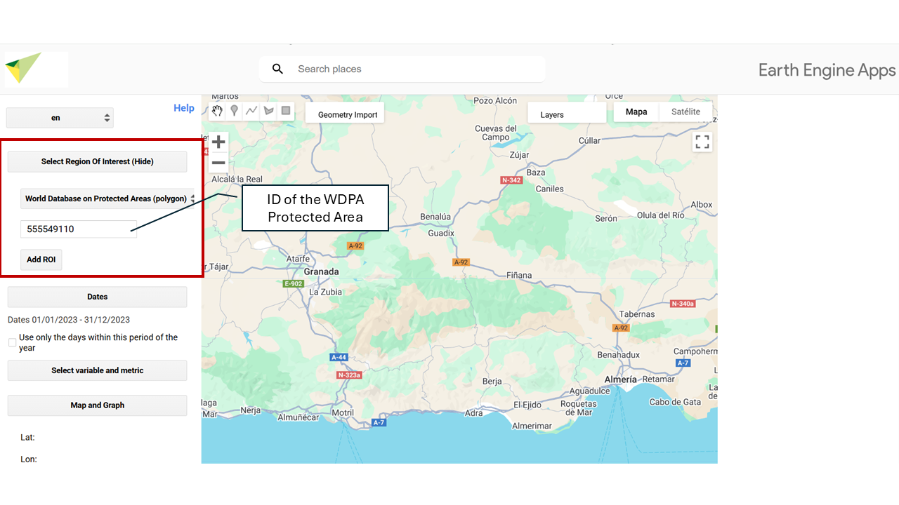
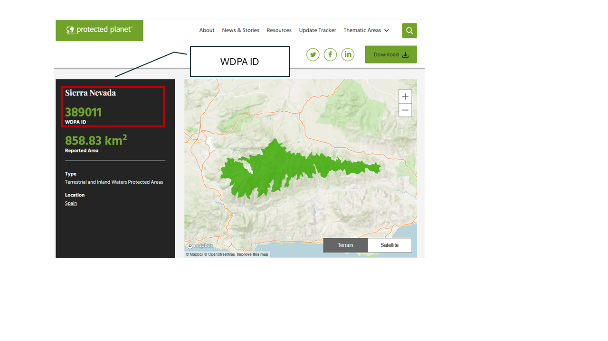

## **📁 Elige un proyecto**

Puedes seleccionar como área de estudio las zonas asociadas a los distintos proyectos desarrollados en el marco de **OBSNEV**. Cada uno de ellos define áreas específicas con distintos enfoques temáticos:

* **EarthCul**: Áreas de influencia socioeconómica de los Parques Nacionales de montaña en España y Portugal.  
* **EVEREST**: Parques Nacionales de montaña de España y Portugal.  
* **PRESINMED**  
* **BioRefuges**

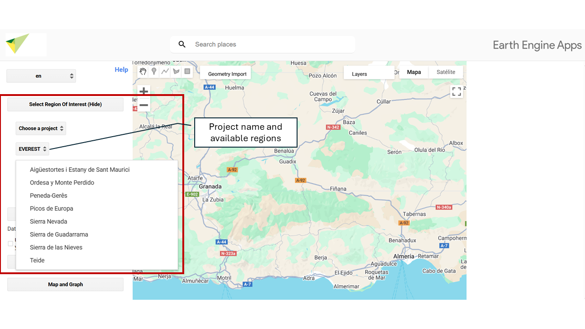

<!--chapter:end:03-area-estudio.Rmd-->

# Fechas de inicio y fin {#fechas}

Elige el rango de fechas para realizar tus cálculos. Primero, establece el **año de inicio** y el **año de fin**. Luego, selecciona el **mes y día de inicio**, así como el **mes y día de finalización** para definir el período de análisis.

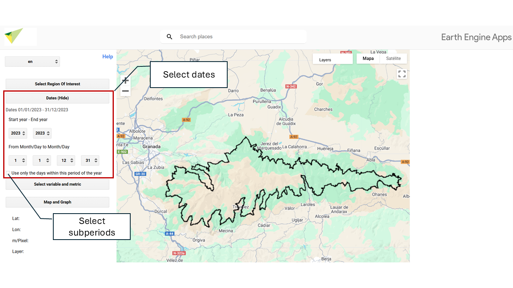
## **📆Comparar con otro periodo**
La herramienta permite seleccionar **dos periodos** para realizar un análisis comparativo de la misma variable, en el mismo ROI para esas dos fechas. Al seleccionar esta opción se mostrará en resultados dos mapas y dos gráficas, cada una con los resultados para cada periodo. El periodo 1 aparece en la parte inferior como "Ref. Map" y el periodo 2 aparece como "Comp. Map".

## **📆Selección de un intervalo específico**

La herramienta permite seleccionar un **intervalo específico dentro del año** para realizar un análisis estacional.

Al activar la opción **“Utilice solo los días de este periodo del año”**, se delimita un rango de fechas (por ejemplo, del **21 de marzo al 21 de septiembre)** que se aplicará a **cada año** del periodo seleccionado (por ejemplo, de 2001 a 2020).

Esto permite analizar únicamente ciertos meses o estaciones, como **primaveras, veranos, o estaciones de crecimiento.**

Si seleccionas:

* Año inicio: 2001  
* Año fin: 2020  
* Desde: 21/03  
* Hasta: 21/09

Se analizarán sólo los días comprendidos entre el 21 de marzo y el 21 de septiembre en cada uno de esos años, excluyendo el resto.

<!--chapter:end:04-periodo.Rmd-->

# Tipo de variable de interés {#tipo-variable}

Selecciona la variable de estudio. Las variables se clasifican en grandes categorías de [EBVs](https://geobon.org/ebvs/what-are-ebvs/) {target=_blank} **(Variables Esenciales de Biodiversidad)**, relacionadas con el funcionamiento y estructura de los ecosistemas. **MonitorEO-OBSNEV** incluye:

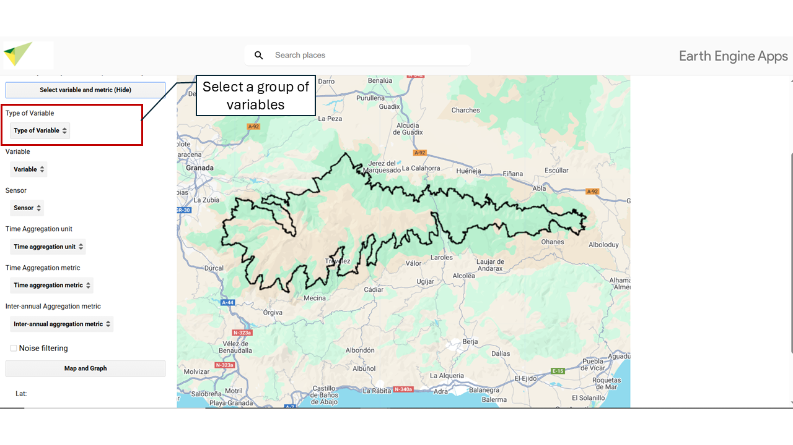

## **🌱 Carbono Orgánico (Producción Primaria)** 

### **NDVI** \- Índice de Vegetación de Diferencia Normalizada

El Índice de Vegetación de Diferencia Normalizada (NDVI, por sus siglas en inglés) es un indicador espectral ampliamente utilizado para cuantificar la cobertura y el estado de la vegetación mediante sensores remotos. Se calcula a partir de la diferencia entre la reflectancia en el infrarrojo cercano (NIR) y la reflectancia en el rojo (RED), normalizada por su suma:

NDV I= NIR- RED / NIR \+ RED

Este índice toma valores entre \-1 y 1\. Valores cercanos a 1 indican vegetación densa y vigorosa, mientras que valores cercanos a \-1 corresponden a superficies no vegetadas, como cuerpos de agua, nieve o áreas urbanas. 

Unidades: sin unidad.

### **EVI** \- Índice de Vegetación Mejorado

El Índice de Vegetación Mejorado (EVI, por sus siglas en inglés) es un indicador espectral desarrollado para optimizar la estimación de la cobertura y condición de la vegetación a partir de datos de teledetección. A diferencia de índices tradicionales como el NDVI, el EVI incorpora factores de corrección atmosférica y una compensación por la influencia del fondo del suelo, lo que mejora su sensibilidad en áreas con alta densidad de vegetación, baja cobertura vegetal o condiciones atmosféricas complejas.

La fórmula general del EVI es la siguiente:

EVI=G⋅ NIR−RED / NIR+C1​⋅RED−C2​⋅BLUE+L

donde:

* NIR: reflectancia en el infrarrojo cercano  
* RED: reflectancia en el rojo  
* BLUE: reflectancia en el azul  
* G: factor de ganancia (generalmente 2.5)  
* L: factor de corrección del suelo (1.0)  
* C1 y C2​: coeficientes de corrección atmosférica (6.0 y 7.5, respectivamente)

Los valores del EVI varían entre \-1 y 1\. Valores cercanos a 1 indican una vegetación densa y saludable, mientras que valores negativos o bajos reflejan áreas sin vegetación, como cuerpos de agua, zonas urbanizadas o superficies nevadas. 

| Valor de EVI | Interpretación ecológica |
| ----- | :---: |
| **\< 0.0** | Agua, nieve, nubes, áreas no vegetadas |
| **0.0 – 0.1** | Suelos desnudos, desiertos, áreas urbanas, rocas |
| **0.1 – 0.2** | Vegetación escasa, pastizales áridos, matorral abierto |
| **0.2 – 0.3** | Pastizales, agricultura de secano, sabanas |
| **0.3 – 0.5** | Bosques abiertos, zonas agrícolas activas (cultivos en crecimiento) |
| **0.5 – 0.7** | Bosques templados densos, cultivos con alta cobertura vegetal |
| **\> 0.7** | Bosques tropicales, selvas, vegetación muy densa |

Unidades: sin unidad.

### **Chl-a** \- Concentración de clorofila

El índice de clorofila-a se utiliza para estimar la concentración de clorofila-a en cuerpos de agua como océanos, lagos y ríos. La clorofila-a es el principal pigmento fotosintético presente en el fitoplancton, por lo que su concentración actúa como un indicador indirecto de la biomasa algal y de la productividad primaria en ecosistemas acuáticos, siendo un indicador clave para evaluar la calidad del agua y la salud de los ecosistemas acuáticos (Gitelson et al., 1993; IOCCG, 2000).

Unidades: mg m-3.

## **🌞 Balance de Radiación** 

### **ALB** \- Albedo

El albedo es la fracción de la radiación solar incidente que es reflejada por una superficie sin ser absorbida. Se trata de un parámetro adimensional que varía entre 0 (absorción total) y 1 (reflexión total). Un albedo elevado indica que la superficie refleja una gran proporción de la energía solar recibida, como ocurre en superficies altamente reflectantes como la nieve o el hielo. En contraste, un albedo bajo implica una mayor absorción de radiación, característica de superficies oscuras como áreas urbanas, suelos húmedos o cuerpos de agua.  
El albedo desempeña un papel clave en el balance energético terrestre y en procesos relacionados con el clima global, ya que influye directamente en la cantidad de energía que entra y se retiene en el sistema climático.

Unidades: sin unidad.

## **💧Balance de Agua** 

### **ET** \- Evapotranspiración

Estimación de la cantidad de agua que se evapora de la superficie terrestre y se transpira por las plantas. Generada a partir del modelo Mu et al. (2011), que implementa un enfoque basado en la ecuación de Penman-Monteith, adaptada para sensores remotos. Permite comprender el ciclo del agua, evaluar la disponibilidad de agua en una región y monitorear los recursos hídricos. 

Unidades: Kj/m^2/8days

### **LE** \- Calor Latente

Estimación indirecta de la energía consumida por la evapotranspiración. Durante el proceso, se requiere energía para romper o formar enlaces entre las moléculas de la sustancia, lo que resulta en la liberación o absorción de calor. El calor latente desempeña un papel fundamental en el ciclo del agua, ya que la evaporación y la condensación son procesos clave en la formación de nubes, la precipitación y la regulación del clima.

Unidades: J/m^2/day

### **LSWI** \- Índice de Agua Superficial Terrestre

El LSWI (Land Surface Water Index) es un índice espectral utilizado para detectar y evaluar la presencia de humedad en la superficie terrestre, particularmente en la vegetación y el suelo. Se basa en la diferencia entre la reflectancia en el infrarrojo cercano (NIR) y el infrarrojo de onda corta (SWIR), que son sensibles al contenido de agua en la vegetación y el suelo.

LSWI \= NIR- SWIR / NIR \+ SWIR​

* NIR: Banda de infrarrojo cercano.

* SWIR: Banda de infrarrojo de onda corta.

**Valores altos** → alta humedad superficial, suelos húmedos, vegetación con alto contenido de agua, humedales o áreas agrícolas irrigadas. 

**Valores bajos** → condiciones secas, vegetación estresada o suelos áridos.

Unidades: sin unidad.

### **NDWI** \- Índice de Agua de Diferencia Normalizada

El NDWI ( Normalized Difference Water Index) es un índice espectral diseñado para detectar y cuantificar la presencia de agua en la superficie terrestre. Se basa en la diferencia de reflectancia entre el infrarrojo cercano (NIR) y el verde (Green), aprovechando la fuerte absorción del agua en el NIR y su alta reflectancia en el visible.

NDWI \= Green \- NIR / Green \+ NIR​

* Green: Banda del verde.  
* NIR: Banda del infrarrojo cercano

**NDWI \> 0** → presencia de **agua superficial** (ríos, lagos, embalses, zonas inundadas)  
**NDWI \< 0** → superficies **terrestres sin agua** (vegetación, suelo desnudo, áreas urbanas)

Unidades: sin unidad.

### **NDSI** \- Índice de Nieve de Diferencia Normalizada

El NDSI ( Normalized Difference Snow Index) es un indicador espectral utilizado para detectar la presencia y extensión de nieve en la superficie terrestre. Se basa en las características reflectivas distintivas de la nieve, que refleja fuertemente en el espectro visible (banda verde) y absorbe significativamente en el infrarrojo de onda corta (SWIR), en contraste con la mayoría de los demás tipos de cobertura terrestre.

NDSI \= Green \- SWIR / Green \+ SWIR​

* **Green**: Banda del verde.  
* **SWIR**: Banda del infrarrojo de onda corta.

**NDSI \> 0.4** → alta probabilidad de presencia de **nieve o hielo.**  
**NDSI \< 0.2** → generalmente indica **ausencia de nieve.**

Estos umbrales pueden ajustarse según la resolución y el sensor utilizado.

Unidades: sin unidad.

## **🌡️ Calor Sensible**
###  **LST** \-Temperatura Superficial

La temperatura de la superficie terrestre (LST, por sus siglas en inglés) se refiere a la temperatura registrada en la capa superior de la superficie terrestre o de los cuerpos de agua, tal como es detectada por sensores remotos. LST se estima a partir de la radiancia térmica captada en el espectro del infrarrojo térmico, y es una variable clave en el análisis de procesos como el balance energético, la evapotranspiración, la sequía, el estrés hídrico y el monitoreo urbano y agrícola.

Unidades: ºC.

## **💨 Nutrientes / Aerosoles** 
### **ARSL** \- Profundidad óptica atmosférica de aerosoles

Cantidad de aerosoles en la columna total atmosférica. Sirve para cuantificar cuánta carga de aerosoles hay en la atmósfera. El espesor óptico total de los aerosoles se refiere a todos los tipos de aerosol mientras que algunos productos de satélite dan información sobre el espesor óptico de un tipo de aerosol en concreto, como por ejemplo, el espesor óptico debido al polvo, que cuantifica la carga de polvo en la columna atmosférica. 

Unidades: sin unidad.

<!--chapter:end:05-tipo-variable.Rmd-->

# Sensor satelital {#sensor}

Selecciona con qué sensor quieres trabajar. Los sensores disponibles poseen distinta resolución temporal y espacial. Dependiendo de la variable elegida, obtendrás disponibilidad de datos para unos u otros sensores. 

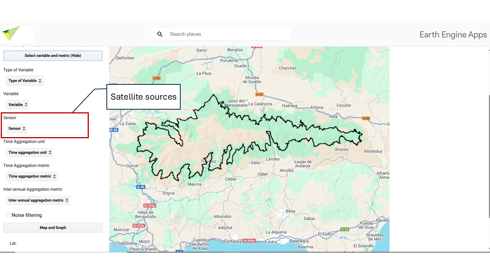

## **🛰️MODIS 250 m, 16 días**

MODIS (*Moderate Resolution Imaging Spectroradiometer*) es un sensor a bordo de los satélites Terra y Aqua de la NASA. 

**Resolución espacial:** Depende de la variable seleccionada. Pueden ser datos a 250m, 1km, 4km... Esta información te aparecerá en la pestaña "Sensor" una vez hayas seleccionado tu variable.
**Resolución temporal:** Depende de la variable seleccionada. Pueden ser datos diarios, cada 8 días o cada 16 días. Esta información te aparecerá en la pestaña "Sensor" una vez hayas seleccionado tu variable.

Para esta interfaz, se han utilizado los datos de las colecciones **MODIS Terra**.

Estos satélites **proporcionan datos desde** el **24/02/2000 hasta la actualidad**, aunque la disponibilidad puede variar según la variable seleccionada.

## **🛰️Landsat 30 m, \> 16 días** 

La serie **Landsat** es operada por la NASA y el USGS. Estos datos incluyen Landsat 5, 7, 8 y 9\. 

**Resolución espacial:** 30 metros. 
**Resolución temporal:** Mayor a 16 días, ya que dependiendo del satélite tienen un período de revisita de 8 o 16 días cada uno. 

El **rango de fechas** cubierto va desde **1984 hasta la actualidad**, dependiendo de la disponibilidad de cada satélite: 
**Landsat 5** (16/03/1984 \- 05/05/2012)
**Landsat 7** (28/05/1999 \- actualidad, con limitaciones desde 31/05/2003 por la falla del ETM+)
**Landsat 8** (18/03/2013 \- presente)
**Landsat 9** (31/10/2021 \- presente)

Entre el **05/05/2012 y el 18/03/2013**, no hay datos disponibles debido a la interrupción en la captura de imágenes de Landsat 7\. Aunque este satélite siguió operando, su utilidad estaba limitada desde 2003 por una falla en el Escáner de Línea de Mejora (ETM+). Debido a esta limitación, a partir de 2003 sus datos no se consideran en el rango completo de fechas disponibles.

## **🛰️Sentinel-2 10m, 5 días** 

El programa **Sentinel-2** es operado por la Agencia Espacial Europea (ESA) y forma parte del programa Copernicus. 

**Resolución espacial:** 10 metros. 
**Resolución temporal:** 5 días. 

En esta interfaz, utilizamos el producto **SR Harmonized**, un producto de Reflectancia de Superficie (SR) ajustado para garantizar la coherencia entre los sensores de Sentinel-2A y Sentinel-2B mediante corrección atmosférica, ajuste espectral y normalización de datos. 

El **rango de fechas** de este sensor va desde **28/03/2017 hasta la actualidad.**

<!--chapter:end:06-sensor.Rmd-->

# Unidad de agregación temporal {#ud-agregacion-temporal}

Selecciona el intervalo temporal sobre el cual deseas realizar los cálculos. Puedes mantener la **resolución temporal original del sensor** o aplicar una **agregación periódica** para facilitar el análisis:

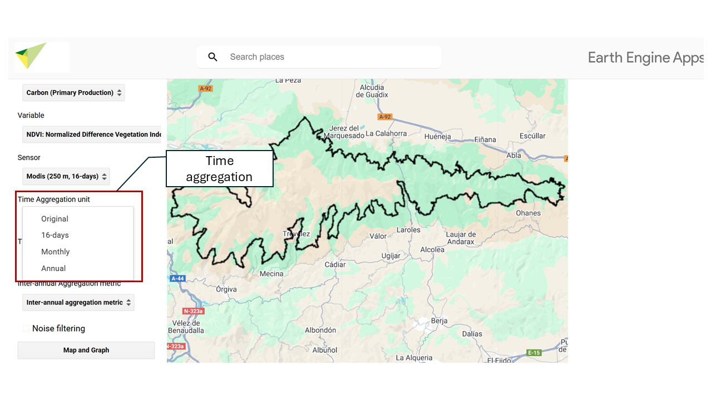

## **Original**

Utiliza la frecuencia nativa del sensor (por ejemplo, diaria, 5 días, 16 días, etc.).

## **Cada 16 días**

Agrupa las observaciones disponibles en intervalos de 16 días.

## **Mensual**

Resume los datos por mes.

## **Anual**

Genera una única observación agregada por año.

La agregación temporal permite suavizar variaciones de corto plazo, facilitar
comparaciones entre periodos, reducir la influencia de datos atípicos o evitar la
perdida de información ocasionado por la presencia de nubes en el área de interés en
fechas concretas.

<!--chapter:end:07-agregacion-temporal.Rmd-->

# Métrica de agregación temporal {#agregacion-temporal}

Selecciona el **método de agregación temporal** que se aplicará al conjunto de datos. Esta opción permite **resumir series temporales** utilizando funciones estadísticas denominadas **reductores** (*reducers*), entre los que se encuentran:

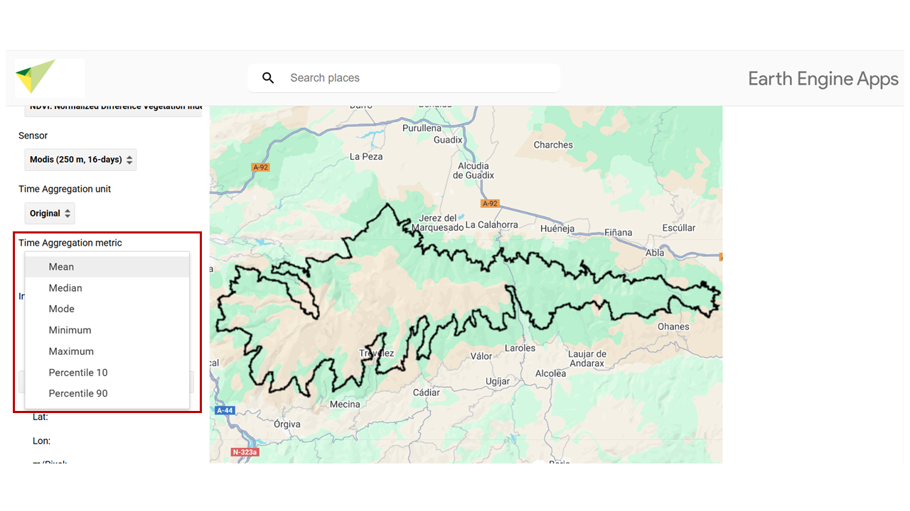

## **Media** 

Calcula el **promedio** de los valores dentro del período de tiempo seleccionado.  

## **Mediana**

Calcula el **valor central** en un conjunto de datos ordenados. Es más resistente a valores extremos que la media.  

## **Moda** 

Calcula el **valor más frecuente** en un conjunto de datos.  

## **Mínimo**

Calcula el **valor más bajo** en un período de tiempo.  

## **Máximo** 

Calcula el **valor más alto** en un período de tiempo.  

## **Percentil 10** 

Encuentra el valor por debajo del cual está el **10% de los datos**. Se usa para medir **valores bajos** o eventos extremos.  

## **Percentil 90** 

Encuentra el valor por debajo del cual está el **90% de los datos**. Se usa para medir **valores altos** o eventos extremos.

<!--chapter:end:08-agregacion-espacial.Rmd-->

# Métrica de agregación temporal interanual {#agregacion-temporal-interanual}

Selecciona el método de agregación temporal para ejecutar tu análisis. Los métodos de **agregación temporal** permiten **resumir datos** en períodos de tiempo utilizando diferentes técnicas estadísticas llamadas **reductores**. 

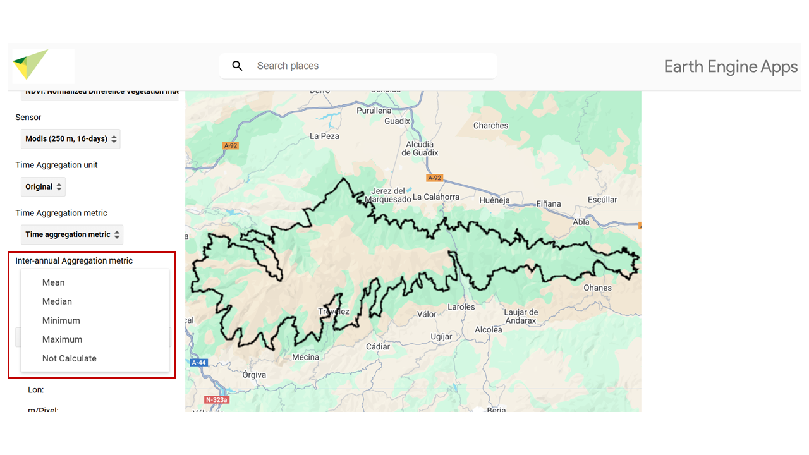

## **Media**

Calcula el **promedio** de los valores por año dentro del periodo de tiempo seleccionado.  

## **Mediana**

Calcula el **valor central** de los valores por año dentro del periodo de tiempo seleccionado. Es más resistente a valores extremos que la media.   

## **Mínimo** 

Calcula el **valor más bajo** por año en un periodo de tiempo.  

## **Máximo** 

Calcula el **valor más alto** por año en un periodo de tiempo.  

## **No calcular** 

No calcula agregaciones temporales por años.

<!--chapter:end:09-agregacion-interanual.Rmd-->

# Filtrado de nubes {#filtrado-nubes}

Al activar esta casilla, se aplicará un **filtrado de nubes por escena**.  El filtrado de nubes por escena es un proceso utilizado en el análisis de imágenes satelitales para eliminar o reducir la interferencia causada por la presencia de nubes en cada imagen, mejorando la calidad de los datos. Como resultado, los análisis reflejarán con mayor precisión las características reales de la superficie terrestre.

Puedes establecer un % de nubosidad, que eliminará las escenas o imágenes que superen el umbral establecido.

<!--chapter:end:10-filtrado-nubes.Rmd-->

# Generar mapas y gráficos de resultados {#mapas-graficos}

## **Calcular** 

Al hacer clic en el botón se generará el resultado según tu selección previa.

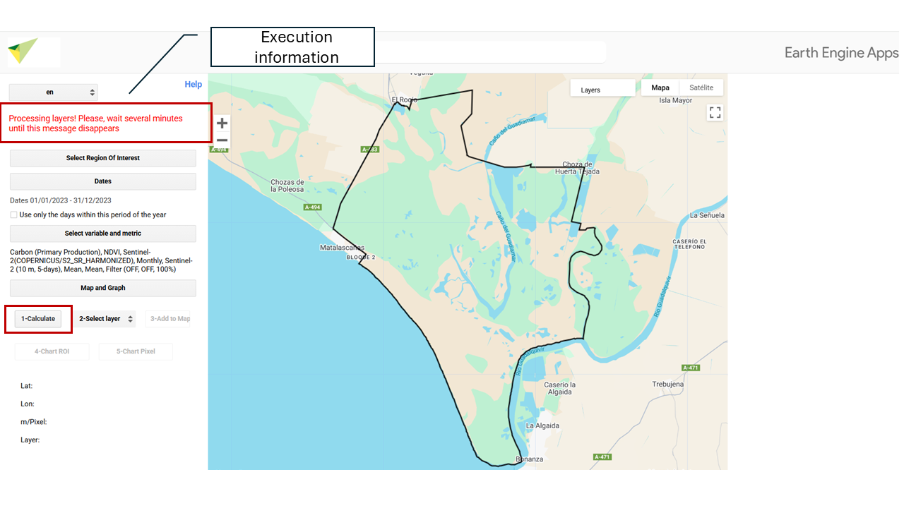

## **Seleccionar capa**

En la sección aparecerán todas las capas/mapas generados durante el cálculo. Para visualizar una capa específica, selecciónala en **"2- Seleccionar capa"** y haz clic en **"3 \- Añadir al mapa”**.

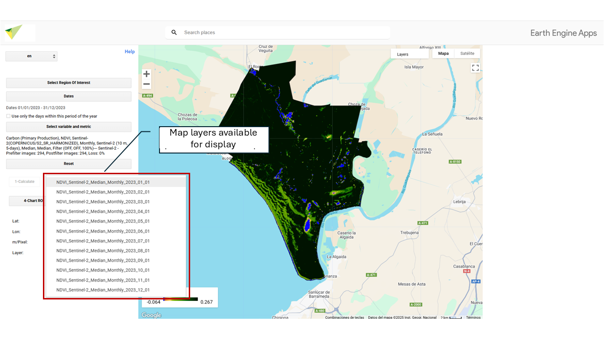

## **Añadir al mapa** 

Dibuja en el mapa la capa seleccionada.

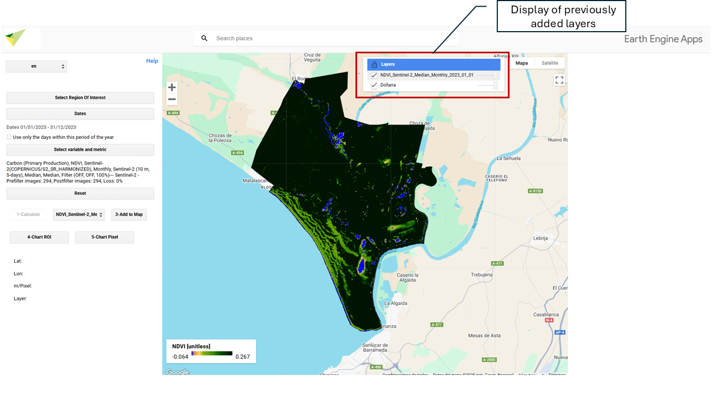
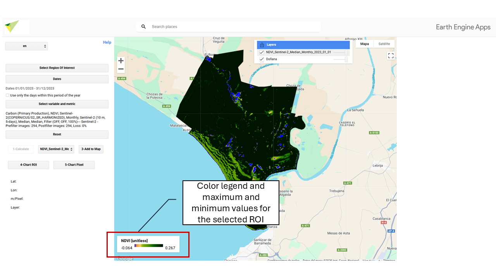

## **Gráfico ROI** 

Genera y visualiza los gráficos asociados a los mapas resultantes de tu Región de Interés (ROI por su siglas en inglés). Genera un calculo promedio.

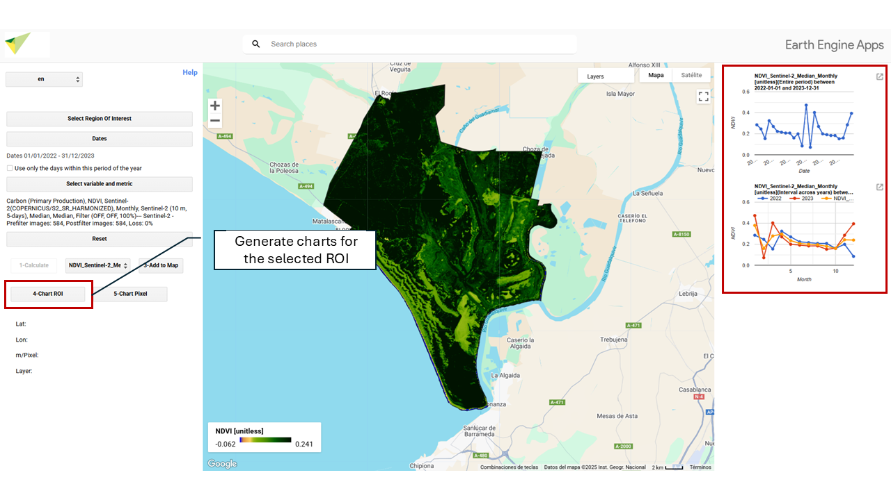

## **Gráfico Pixel** 

Genera y visualiza los gráficos asociados a un píxel seleccionado con tu cursor. Cuando pinchas en un punto de tu área de estudio, esta opción te mostrará los datos correspondientes a su Latitud, Longitud, m/píxel (muestra la resolución del mapa en ese nivel de zoom, en metros por píxel) y el nombre de la capa que estás visualizando.

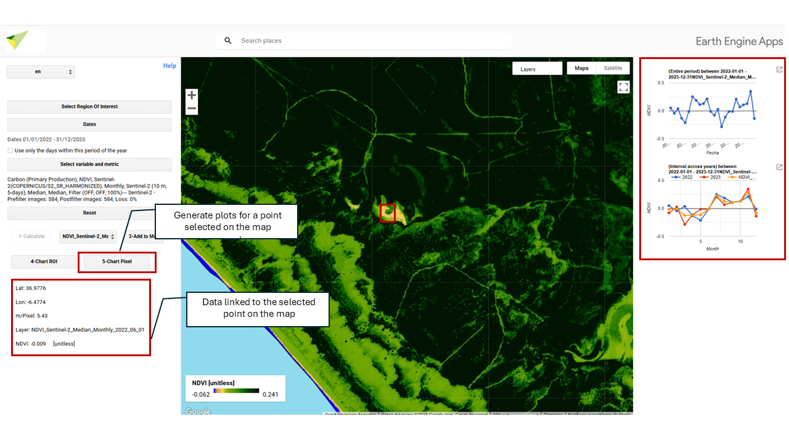

<!--chapter:end:11-mapas-graficos.Rmd-->

